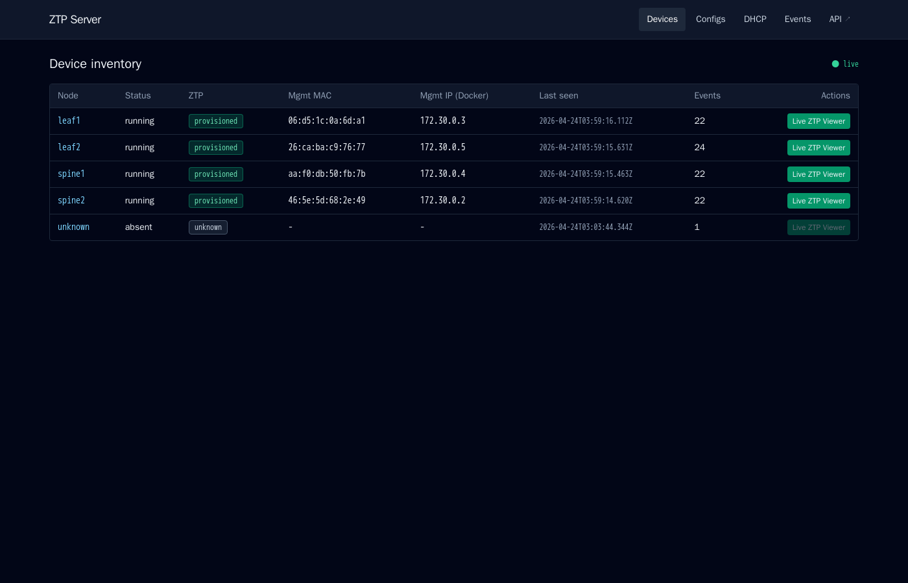
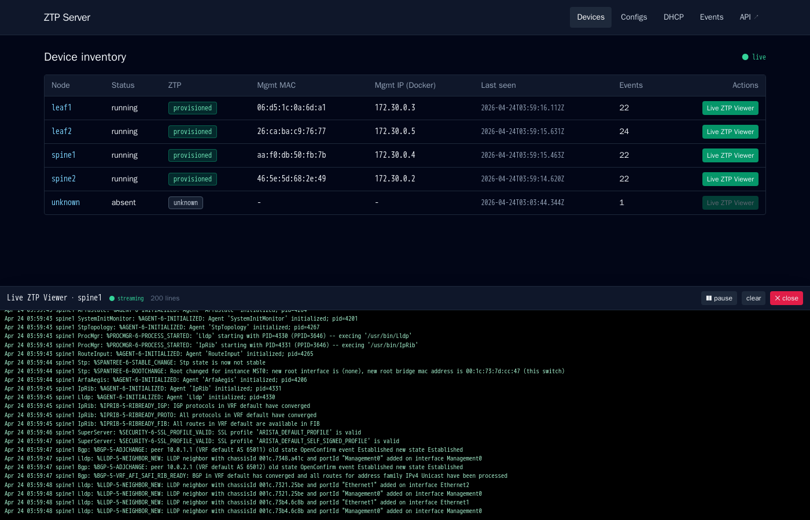
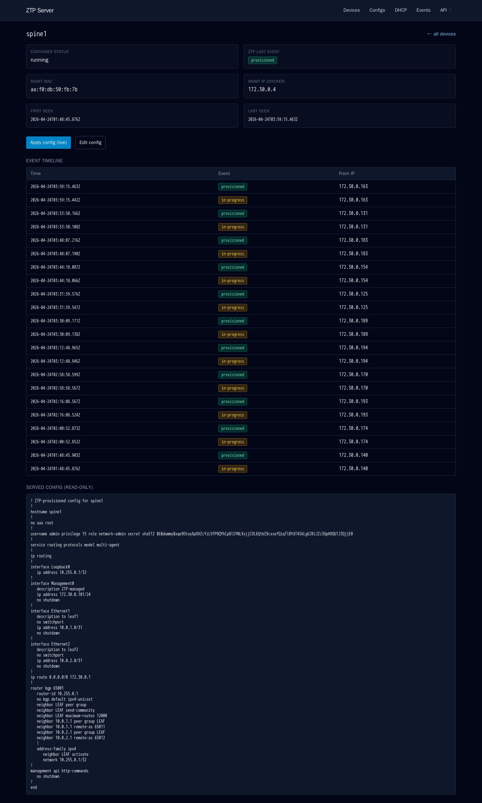
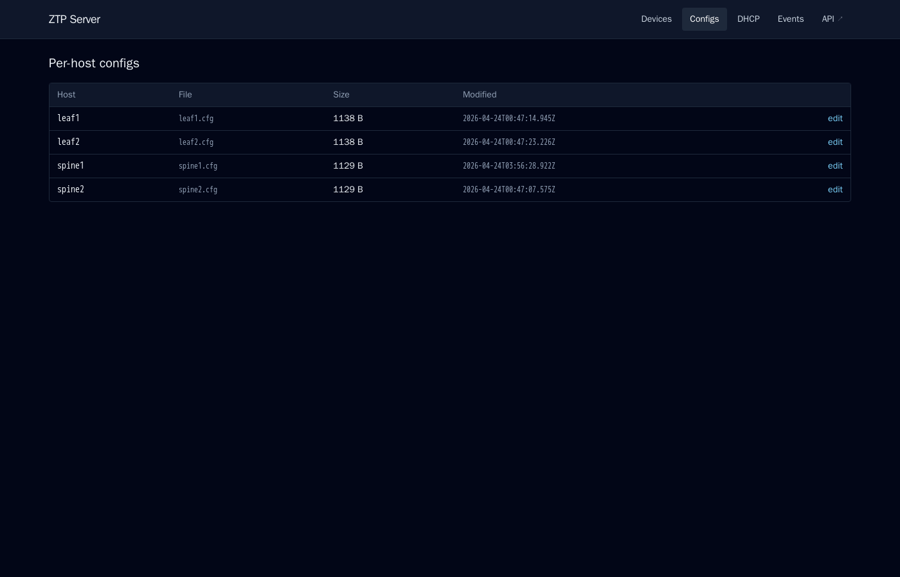
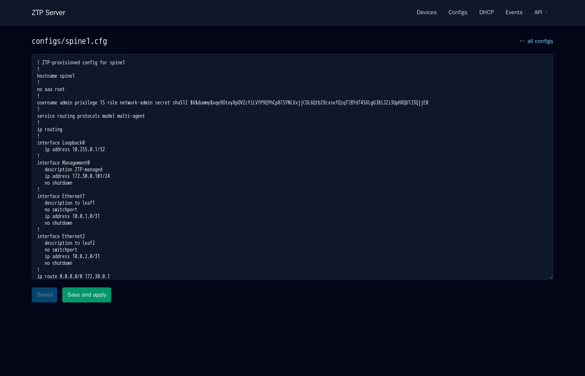
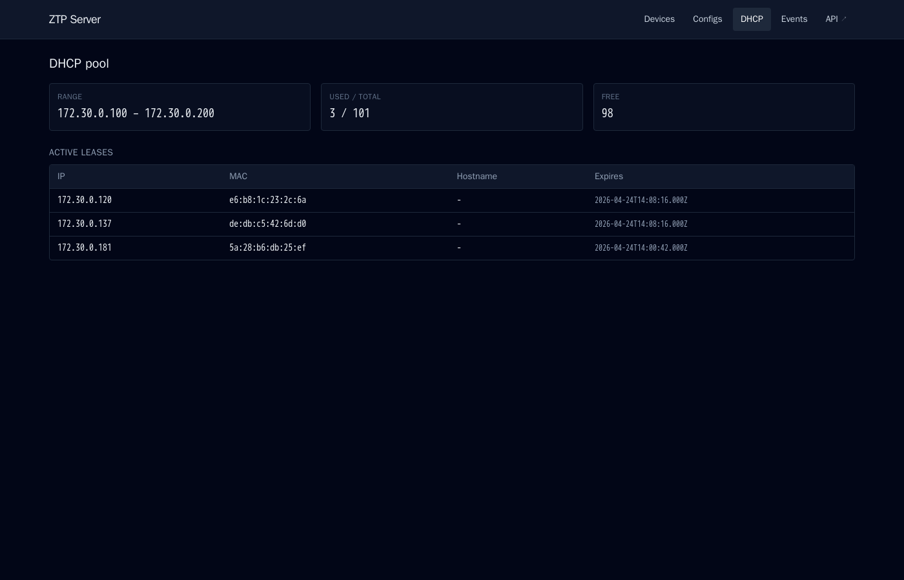
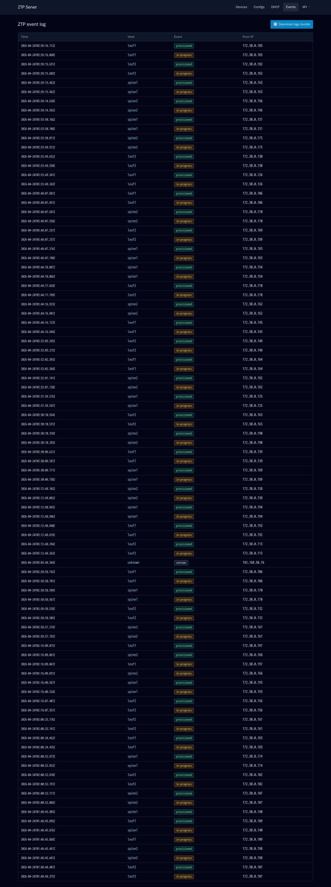
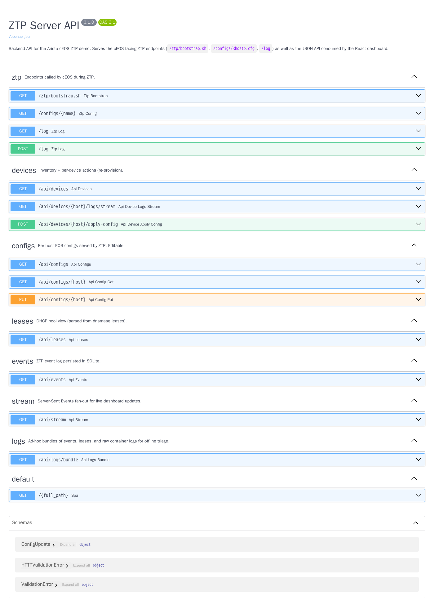

# Arista cEOS ZTP Demo (Containerlab)

End-to-end Zero Touch Provisioning lab for Arista cEOS, with a built-in
web dashboard. Four switches (2 spines + 2 leaves) boot with **no
startup-config**, broadcast DHCP on Management0, and pull per-device
configuration from the ZTP server. The whole stack — DHCP server, ZTP/UI
app, and the cEOS fabric — comes up with a single `containerlab deploy`.



## Architecture

```
       ┌────────────────────────────────────────────────────────┐
       │  ztp-mgmt bridge   172.30.0.0/24                       │
       │                                                        │
       │  ztp-dhcp (dnsmasq)         ztp-app (FastAPI + React)  │
       │   172.30.0.10                172.30.0.20  →  host:8080 │
       │      ▲                          ▲                      │
       │      │ DHCP DISCOVER/OFFER      │ HTTP GET / POST      │
       │      │                          │                      │
       │  spine1  spine2  leaf1  leaf2                          │
       └────────────────────────────────────────────────────────┘
                  │       │       │       │
                  └─── point-to-point fabric links ───┘
```

The `ztp-app` container runs a single FastAPI process that serves:

- the cEOS-facing endpoints (`/ztp/bootstrap.sh`, `/configs/<host>.cfg`, `/log`),
- a JSON API (`/api/devices`, `/api/configs`, `/api/leases`, `/api/events`, `/api/stream`),
- and the React dashboard SPA on `/`.

ZTP events are persisted to SQLite (`./data/ztp.db`). The DHCP lease file is
written to a host-bound `./dhcp-state/` directory and read by the app for
the DHCP pool view. The Docker socket is mounted into `ztp-app` so the
**Re-provision** action can clear `/mnt/flash/startup-config` and restart
the target cEOS container.

## ZTP flow per device

1. cEOS boots with no `/mnt/flash/startup-config` → enters ZTP mode.
2. Sends `DHCPDISCOVER` on Management0.
3. `dnsmasq` replies with a lease and DHCP Option 67 bootfile URL
   `http://172.30.0.20/ztp/bootstrap.sh` (same URL for every client).
4. cEOS downloads `bootstrap.sh` and executes it. The script reads
   `CLAB_LABEL_CLAB_NODE_NAME` from `/proc/1/environ` (set by containerlab),
   POSTs `event=start` to `/log`, `curl`s `/configs/<node>.cfg`, writes it
   to `/mnt/flash/startup-config`, and POSTs `event=done`.
5. cEOS detects ZTP success, reboots, and comes up with the new config.

> **Why identify by node name and not by MAC?** Docker assigns a random MAC
> to each container's `eth0` and re-randomizes it on `docker restart`, so
> MAC reservations in `dnsmasq.conf` are not stable. cEOS does not send
> `SERIALNUMBER` as the DHCP hostname either. The systemd init env var that
> containerlab injects is the cleanest stable per-device identifier
> available from inside the cEOS bash environment.

## Web UI

After `make deploy`, browse to **`http://<lab-host-ip>:8080`** (the
Makefile prints the URL when the deploy finishes — note that `localhost`
only works if you're on the lab host itself).

### Devices

Live inventory: container status, ZTP state pill (`provisioned` /
`in-progress` / `unknown`), current Docker MAC and IP, last seen, event
count. Updates push in via Server-Sent Events; the `● live` badge in the
top right reflects the SSE connection.


The **Live ZTP Viewer** button per row opens a drawer at the bottom of
the page that streams `docker logs -f` for that cEOS container — useful
for watching the systemd boot, ZTP DHCP exchanges, the bootstrap script
running, and the post-ZTP reboot. Backed by the SSE endpoint
`GET /api/devices/{host}/logs/stream`.



### Device detail

Per-device summary, full event timeline, the served EOS config, and two
actions: **Edit config** (jumps to the editor) and **Apply config (live)**,
which hot-swaps the device's running and startup config to the file the
ZTP server is currently serving — `FastCli configure replace <url> force`
+ `write memory`. No reboot, no netns teardown, no fabric impact (see
*Limitations* below for why we don't reboot the cEOS).



### Configs

Lists all per-host EOS configs served by the ZTP endpoint, with file size
and last-modified time.



### Config editor

In-browser editor for `ztp-content/configs/<host>.cfg`. **Save** writes
the file; **Save and apply** also pushes the new content into the live
cEOS via `configure replace` (no reboot).



### DHCP pool

Live view of the dnsmasq lease pool — range, used / total, free, and the
active leases parsed from `dnsmasq.leases`.



### Events

Full chronological event log across all devices. Click a host name to jump
to its detail page. The **⬇ Download logs bundle** button in the top right
fetches a `.tar.gz` of the current ZTP events (JSON), the DHCP lease
snapshot, the raw dnsmasq DHCP log, the FastAPI access log, and a
manifest — handy for filing a bug or sharing a deploy state. Backed by
`GET /api/logs/bundle`.



### API (Swagger)

The toolbar's **API ↗** link opens FastAPI's auto-generated Swagger UI at
`/docs`. Endpoints are grouped by tag (`ztp`, `devices`, `configs`,
`leases`, `events`, `stream`) and each is "Try it out"-able directly from
the page. The raw OpenAPI 3.1 schema is at `/openapi.json`.



## Node / IP / config map

| Node    | DHCP-assigned mgmt IP | Final mgmt IP   | Config                       |
|---------|-----------------------|-----------------|------------------------------|
| spine1  | dynamic (`.100–.200`) | `172.30.0.101`  | `ztp-content/configs/spine1.cfg` |
| spine2  | dynamic (`.100–.200`) | `172.30.0.102`  | `ztp-content/configs/spine2.cfg` |
| leaf1   | dynamic (`.100–.200`) | `172.30.0.103`  | `ztp-content/configs/leaf1.cfg`  |
| leaf2   | dynamic (`.100–.200`) | `172.30.0.104`  | `ztp-content/configs/leaf2.cfg`  |

## Fabric

```
spine1 (AS 65001)        spine2 (AS 65002)
   eth1 ─ leaf1 eth1        eth1 ─ leaf1 eth2
   eth2 ─ leaf2 eth1        eth2 ─ leaf2 eth2
```

eBGP underlay, `/31` p2p links:

| Link              | Spine side | Leaf side |
|-------------------|------------|-----------|
| spine1 ↔ leaf1    | 10.0.1.0   | 10.0.1.1  |
| spine1 ↔ leaf2    | 10.0.2.0   | 10.0.2.1  |
| spine2 ↔ leaf1    | 10.0.3.0   | 10.0.3.1  |
| spine2 ↔ leaf2    | 10.0.4.0   | 10.0.4.1  |

Loopbacks: spine1 `10.255.0.1`, spine2 `10.255.0.2`, leaf1 `10.255.0.11`, leaf2 `10.255.0.12`.

## Quickstart

```bash
make deploy        # builds dnsmasq + ztp-app images, then containerlab deploy
                   # prints the UI URL when done
make dhcp-logs     # watch DHCP exchanges
make app-logs      # tail the FastAPI access log
make ztp-events    # filter to just the ZTP /log POSTs
```

First boot takes ~60–120 s per cEOS (boot, ZTP DHCP, fetch, reboot, second
boot with applied config). All four ZTPs typically complete within ~90 s
of `make deploy` finishing.

## Lifecycle

| Goal                                                | Command                                                          |
|-----------------------------------------------------|------------------------------------------------------------------|
| Bring up the lab                                    | `make deploy`                                                    |
| Tear down the lab                                   | `make destroy`                                                   |
| Re-run ZTP from scratch (only path, see below)      | `make redeploy`                                                  |
| Apply the current per-host config to a live device  | UI → device → **Apply config (live)** (no reboot)                |
| Rebuild only the app image                          | `make build-app`                                                 |
| Wipe persistent state (events, leases)              | `make destroy && sudo rm -rf data dhcp-state && make deploy`     |

## Limitations

**You cannot restart a single cEOS container without breaking the fabric.**
Containerlab creates the data-plane links between cEOS nodes
(`spine1:eth1↔leaf1:eth1`, etc.) as raw `veth` pairs in the host network
namespace, then moves one end into each container's netns. They are not
Docker-managed.

When a container stops or restarts, Docker tears down its netns. The
kernel deletes the interfaces inside it, and the **peer** ends in the
*other* cEOS containers die with them (veth pairs are inseparable). The
restarted cEOS then blocks on `if-wait.sh` ("Connected 0 interfaces out
of 2 (waited Ns)") because `eth1`/`eth2` are gone, and the peer cEOS
silently lose their links to it.

cEOS-lab itself has no working in-container reload — `reload now` is
explicitly blocked ("not supported on this hardware platform"),
`systemctl reboot` exits the container, and there is no `/sbin/reboot`.

Practical consequences:

- **`docker restart` / `docker stop+start` of a cEOS = lab is broken.**
  Recover with `make redeploy`.
- **Use the UI's *Apply config (live)* button** to push a new config to a
  cEOS without a reboot. It does `FastCli configure replace <url> force`
  + `write memory`, which mutates the running config in place. Veths
  stay up; ZTP does *not* re-run.
- **`docker stop`/`restart` of `ztp-app` and `ztp-dhcp` is fine** — those
  containers only have an `eth0` (mgmt), no fabric veths.
- **To demonstrate ZTP from a clean slate, use `make redeploy`** (full
  destroy + deploy of the lab). Containerlab 0.74 does not support
  adding or replacing a single node in an existing lab — `deploy
  --node-filter` errors with "lab already deployed".

## Verify

```bash
# 1. UI on the lab host's LAN IP
curl -s http://<lab-host-ip>:8080/api/devices | jq
curl -s http://<lab-host-ip>:8080/api/leases  | jq
curl -s http://<lab-host-ip>:8080/api/events  | jq

# 2. Applied config on a switch
make cli-spine1
spine1# show version
spine1# show ip bgp summary            # established to both leaves
spine1# show zerotouch                 # -> Zerotouch is disabled

# 3. Fabric reachability
spine1# ping 10.0.1.1                  # leaf1 over Ethernet1
```

## Editing configs

Two ways:

- **From the UI**: Configs → `<host>` → edit → Save (or Save and
  re-provision).
- **From the shell**: edit `ztp-content/configs/<host>.cfg`. The file is
  bind-mounted live into the app, so the next ZTP fetch sees it. Trigger
  re-ZTP for one node from the UI, or run `make re-ztp` to re-do all four.

## Layout

```
.
├── topology.clab.yml          # containerlab topology
├── Makefile                   # deploy / destroy / re-ztp / cli helpers
├── docs/screenshots/          # UI screenshots used in this README
├── ztp-server/
│   ├── dnsmasq/
│   │   ├── Dockerfile         # alpine + dnsmasq
│   │   └── dnsmasq.conf       # single Option 67 URL; leases → /dhcp-state
│   └── app/                   # FastAPI + React, served by single uvicorn
│       ├── Dockerfile         # multi-stage: vite build → python:3.12-slim
│       ├── requirements.txt
│       ├── main.py            # ZTP endpoints + REST API + SSE + SPA mount
│       ├── db.py              # SQLite event store
│       ├── leases.py          # dnsmasq lease parser
│       ├── docker_ctl.py      # Docker SDK: list cEOS, re-provision
│       └── ui/                # Vite + React + TS + Tailwind
│           ├── package.json
│           └── src/{App,api,hooks/useSSE,pages/*,components/*}
├── ztp-content/               # bind-mounted into ztp-app at /ztp-content
│   ├── ztp/bootstrap.sh       # universal cEOS bootstrap script
│   └── configs/<host>.cfg     # final EOS startup-configs (editable in UI)
├── startup/<host>.cfg         # empty marker files (force ZTP)
├── dhcp-state/                # dnsmasq leases (shared with ztp-app, read-only)
└── data/                      # SQLite event store (ztp.db)
```

## UI development loop

You can iterate on the React UI against the running lab without rebuilding
the container image:

```bash
make ui-dev                  # vite dev server on localhost:5173
                             # proxies /api, /ztp, /configs, /log to localhost:8080
```

When ready, `make build-app && make redeploy` rebuilds and ships the change.

## Regenerating the screenshots

The screenshots in `docs/screenshots/` are captured headlessly with
puppeteer-in-Docker:

```bash
sudo docker run --rm \
  --network ztp-mgmt \
  -v $(pwd)/docs/screenshots/capture.js:/usr/src/app/capture.js:ro \
  -v $(pwd)/docs/screenshots:/out \
  -w /usr/src/app --entrypoint node \
  zenika/alpine-chrome:with-puppeteer capture.js
```

## Troubleshooting

- **UI not loading**: the host port is `8080`, but `localhost:8080` only
  works on the lab host itself. From a remote browser, use the lab host's
  LAN IP. `make app-logs` tails the FastAPI access log.
- **`/api/devices` is empty**: the Docker socket bind isn't working. Check
  `make app-logs` for permission errors.
- **No DHCPOFFER for a node**: shouldn't happen with the
  single-bootfile-URL setup. If it does, check `make dhcp-logs` — the
  cEOS may not have reached the bridge yet.
- **cEOS keeps re-running ZTP**: the bootstrap script failed to write
  `/mnt/flash/startup-config`. Hit `/api/events?limit=20` to see whether
  `event=start` is firing without `event=done`, and inspect the per-host
  config under `ztp-content/configs/`.
- **Conflicting bridge subnet**: this lab uses `172.30.0.0/24`, separate
  from the default `clab-mgmt` bridge on `172.20.1.0/24`.
